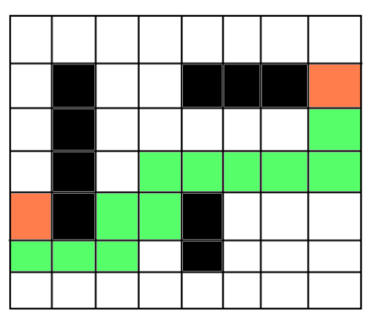

# Pathfinder
Simple game which allows you to find routes between two designated points bypassing obstacles 

# Description
Create a program that solves a task of finding a route using А* algorithm

_Technology restrictions: task has to be implemented using **HTML**, **CSS** and **JavaScript**(plain, without any frameworks )_

Expected functionality:

1. Display a square table on a page ("Board") of arbitrary dimension(e.g. 50 rows and 50 columns)
2. Provide controls adjacent to the Board which allow a user to perform following actions: 
  * Set Start/End points
  * Set obstacles
  * Launch a search of a route between Start point and End point bypassing obstacles 

3. During the search processed cells should change its colour(e.g. become grey)

Here is an example of a resulting Board(ends – orange cells, obstacles - black, found route - green):

_Updated_: 
* Added possibility to randomly generate positions of ends and obstacles in addition to manual selection 